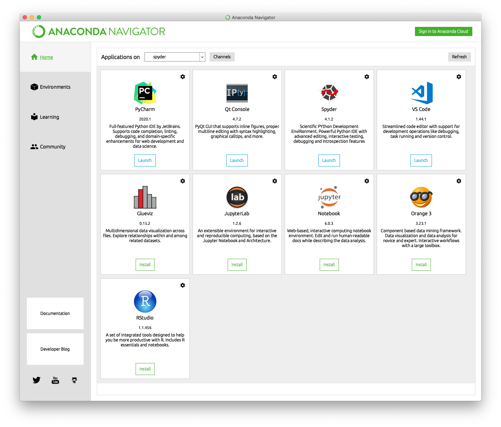
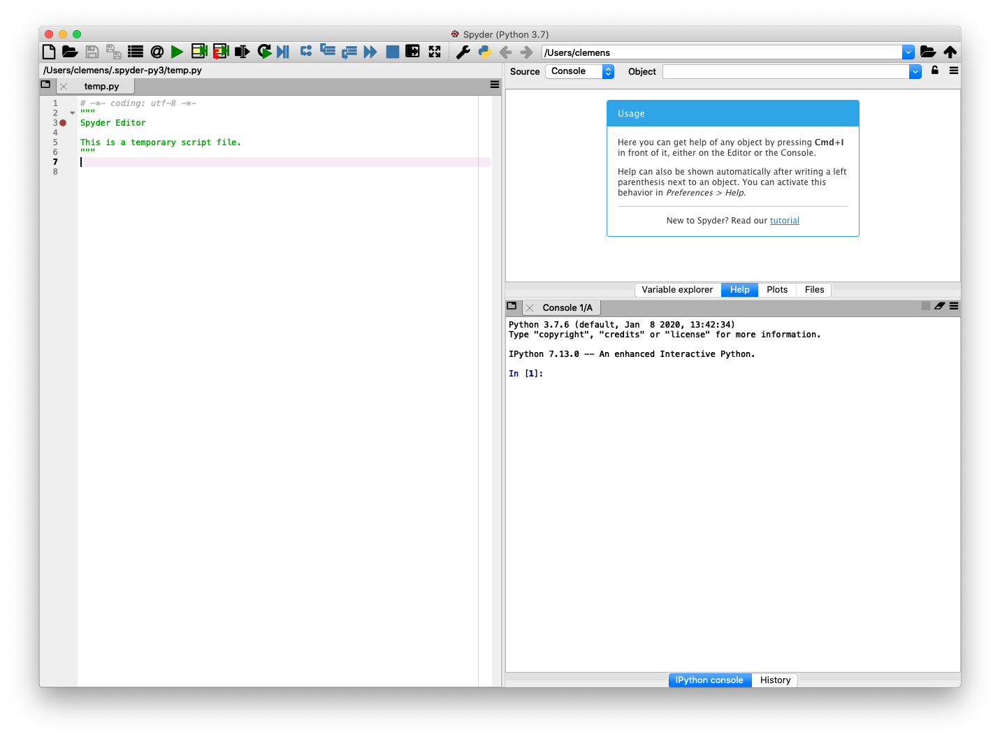

1 - Basics
==========
Introduction
------------
In this workshop you will learn to program in Python. This is a course for beginners, so you do not need to be fluent in any other programming language. In fact, it is perfectly OK if you have never programmed before.

We will start from scratch and learn how to set up a working Python environment, including package management and related housekeeping tasks. Once you have Python on your computer, we will dive into its elegant syntax and talk about basic building blocks of the Python language, such as functions, conditions, and loops. We will then discuss important data types in Python, focussing on strings, lists, and dictionaries. Afterwards, we will start using these building blocks to solve simple tasks such as reading/writing text from/to a file. Finally, we will briefly introduce widely used third-party packages for scientific computing. Specifically, we will touch upon packages that allow us to efficiently work with numerical data and tabular data, including simple graphical representations.

With that out of the way, let's get started!

Overview
--------

https://xkcd.com/353/

Here are some facts about Python (some of which might reflect my personal opinion):

- Simple, elegant, and fun to learn and use
- Open source (not only free as in beer but also free as in speech)
- Cross-platform (meaning that Python runs on Windows, macOS, and Linux)
- General-purpose programming language (meaning that Python is not specifically designed to be extremely good in one particular area such as statistics &ndash; it can be used for many different applications such as data analysis, web servers, graphical user interfaces, programming the [Raspberry Pi](https://www.raspberrypi.org/), and so on)
- Batteries included approach (the so-called [standard library](https://docs.python.org/3/library/) shipping with Python contains many useful things ready for use)
- Huge amount of [third-party packages](https://pypi.org/) that implement even more useful things
- Large and friendly community (Pythonistas)

Python was first released by [Guido van Rossum](https://en.wikipedia.org/wiki/Guido_van_Rossum) way back in 1991, and its popularity has skyrocketed in the past few years.

IEEE

StackOverflow

So far we have only talked about Python without seeing what the language actually looks like. Here's a sneak peak at what you will be able to understand after completing this course:

```python
print("Hello World!")
print("upper_case_me".upper())

for i in range(10):
    print(i, end="-")

s = ", ".join([str(i) for i in range(10)])

lst = [k**2 for k in range(0, 100, 10)]
```

Installation
------------
The [official Python website](https://www.python.org/) is a great resource for everything related to Python. The download section contains installers for many platforms, including Windows and macOS. However, it is usually easier for new Pythonistas to download the [Anaconda](https://www.anaconda.com/) distribution instead, because in addition to Python, this distribution includes many useful additional packages out of the box.

The question whether to install Python 2 or Python 3 has been a great source of confusion and debate, but as of 2020, the answer is simple: Always go for Python 3 (Python 2 is not maintained anymore). Although the differences between the two versions might seem miniscule, it is important that you make sure you are always using Python 3 if you want to follow along in this course. In fact, most code might work in Python 2, but some code will give errors, and I won't cover the differences and modifications required to make it work in Python 2.

First steps
-----------
After installing Anaconda, it is fun to enter some simple Python commands and see what happens. The program which accepts and interprets Python commands is called the Python interpreter. It can be invoked in various ways, but one of the easiest is to use [Spyder](https://www.spyder-ide.org/), a scientific Python development environment. Luckily, Anaconda comes with Spyder, which we can fire up either from the start menu (on Windows), from the terminal (on macOS), or with [Anaconda Navigator](https://docs.anaconda.com/anaconda/navigator/) (available on all platforms).

Using Anaconda Navigator, click on the "Launch" icon at the bottom of the Spyder application box:



Eventually, Spyder should open up and the main program window should look something like this:



The Python interpreter runs in the section at the bottom right called "IPython console". This is where you can enter Python commands, and Python will happily try to execute what you just typed (the so-called [REPL](https://en.wikipedia.org/wiki/Read%E2%80%93eval%E2%80%93print_loop), short for read-eval-print loop).

The Python interpreter includes a prompt, which is typically either one of the following two character sequences:
- `>>>`
- `In [1]:`

Whatever the prompt looks like (in Spyder it's the latter version), this prompt means that Python is waiting for user input, so you can type in a Python command and hit enter to run it. Python will show the result of this command (if any) on the next line, which will not be prepended with a prompt. That way you can distinguish between input and output (see the following examples for this mechanism in action).

Let's try to use Python as a calculator. Python supports the four basic arithmetic operations (addition, subtraction, multiplication, and division):

```python
>>> 1 + 1
2
```
```python
>>> 10 - 7
3
```
```python
>>> 7 * 8
56
```
```python
>>> 120 / 7
17.142857142857142
```

Furthermore, Python can also compute the result of integer division and its remainder:

```python
>>> 120 // 7
17
```
```python
>>> 120 % 7
1
```

Exponentiation (raising one number to the power of another) works with the `**` operator:
```python
>>> 2**64
18446744073709551616
```

Finally, Python knows the correct order of operations and is able to deal with parentheses ([PEMDAS](https://en.wikipedia.org/wiki/Order_of_operations#Mnemonics)):

```python
>>> (13 + 6) * 8 - 12 / (2.5 + 1.6)
149.0731707317073
```

Note that Python accepts only parentheses (and not square or curly brackets) even when there are nested expressions:

```python
>>> ((13 + 6) * 8) / (12 / (2.5 + 1.6))
51.93333333333333
```

Bear in mind that decimal numbers use a point as decimal separator and not a comma.

For more advanced calculations such as calculating square roots, logarithms or trigonometric functions, we need to import [`math`](https://docs.python.org/3/library/math.html) from the standard library to use functions from this module.

```python
>>> import math
```

After entering this command, we can compute the square root of 2 as follows:
```python
>>> math.sqrt(2)
1.4142135623730951
```

Mathematical constants such as Euler's number *e* (`math.e`) and $\pi$ (`math.pi`) are also available:
```python
>>> 1 + math.sqrt(math.e) * 7 - 2 * math.pi * 1.222
4.862996449527442
```

Exercises
---------
