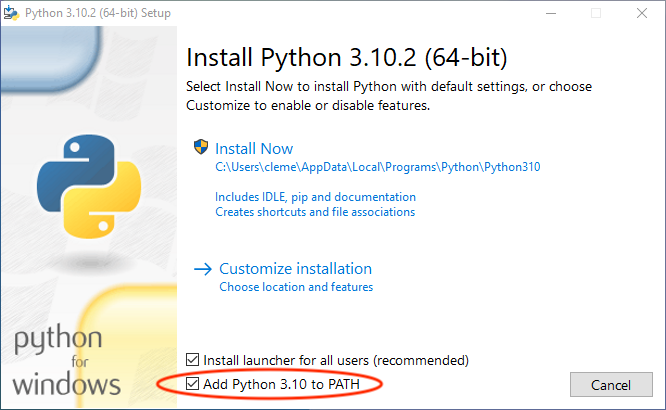

1 – Basics
==========
Introduction
------------
In this workshop you will learn to program in Python. This is a course for beginners, so you do not need to be fluent in any other programming language. In fact, it is perfectly OK if you have never programmed before.

We will start from scratch and learn how to set up a working Python environment, including package management and related housekeeping tasks. Once you have Python on your computer, we will dive into its elegant syntax and talk about basic building blocks of the Python language, such as functions, conditions, and loops. We will then discuss important data types in Python, focussing on strings, lists, and dictionaries. Afterwards, we will start using these building blocks to solve simple tasks such as reading/writing text from/to a file. Finally, we will briefly introduce widely used third-party packages for scientific computing. Specifically, we will touch upon packages that allow us to efficiently work with numerical data and tabular data, including simple graphical representations.

With that out of the way, let's get started!

Overview
--------

(https://xkcd.com/353/)

Here are some facts about Python (some of which might reflect my personal opinion):

- Simple, elegant, and fun to learn and use
- Open source (not only [free as in beer but also free as in speech](https://en.wikipedia.org/wiki/Gratis_versus_libre))
- Cross-platform (Python runs on Windows, macOS, and Linux)
- General-purpose programming language (Python is not specifically designed to be extremely good in one particular area such as statistics &ndash; it can be used for many different applications including data analysis, web servers, graphical user interfaces, programming the [Raspberry Pi](https://www.raspberrypi.org/), and so on)
- Batteries included approach (the so-called [standard library](https://docs.python.org/3/library/) shipping with Python contains many useful things ready for use)
- Huge amount of [third-party packages](https://pypi.org/) that implement even more useful things
- Large and friendly community (Pythonistas)

Python was first released by [Guido van Rossum](https://en.wikipedia.org/wiki/Guido_van_Rossum) way back in 1991, and its popularity has skyrocketed in the past few years. While there are many ways to measure popularity of a programming language, the [TIOBE index](https://www.tiobe.com/tiobe-index/) simply counts the number of search engine results for queries containing the name of the programming language. According to this index, the most popular programming languages in January 2022 were:

| Rank  | Programming language | Rating
| -----:| ---------------------| ------:
|     1 | Python               | 13.58%
|     2 | C                    | 12.44%
|     3 | Java                 | 10.66%
|     4 | C++                  |  8.29%
|   ... | ...                  | ...
|    12 | R                    |  1.25%
|   ... | ...                  | ...
|    16 | MATLAB               |  0.96%
|   ... | ...                  | ...
|    28 | Julia                | 0.39%

[IEEE Spectrum](https://spectrum.ieee.org/top-programming-languages/) compiles another popular (annual) ranking. These are the top ten languages for 2021:

| Rank  | Programming language
| -----:| --------------------
|     1 | Python
|     2 | Java
|     3 | C
|     4 | C++
|     5 | JavaScript
|     6 | C#
|     7 | R
|     8 | Go
|     9 | HTML
|    10 | Swift

Finally, one of the results of the [Stack Overflow Developer Survey 2021](https://insights.stackoverflow.com/survey/2021) is that *"Python passed SQL to become our third most popular technology"* and *"Python is the most wanted language for its fifth-year"*.

So far we have only talked about Python without seeing what the language actually looks like. Here's a sneak peak at what you will be able to understand after completing this course:

```python
print("Hello World!")
print("upper_case_me".upper())

for i in range(10):
    print(i, end="-")

s = ", ".join([str(i) for i in range(10)])

lst = [k**2 for k in range(0, 100, 10)]
```

Installation
------------
The [official Python website](https://www.python.org/) is a great resource for everything related to Python. The [download](https://www.python.org/downloads/) section contains installers for many platforms, including Windows and macOS. If you are on Linux, I recommend that you use your package manager to install Python (in most cases, Python will already be installed anyway).

On Windows, make sure to check the option "Add Python 3.10 to PATH" – by default this is disabled. I strongly recommend to use the suggested values for all other settings (but if you do not have administrator privileges you can uncheck the first option "Install launcher for all users (recommended)").



First steps
-----------
After installing Python, it is fun and instructive to enter some simple Python commands and see what happens. The program which understands and interprets Python commands is called the *Python interpreter*. It can be invoked in various ways, but one of the easiest options is to run it is from the command line (or terminal), a powerful text-based program provided by your operating system.

- On Windows, you should see a start menu entry inside the Python folder named "Python 3.10 (64-bit)" (or similar). Alternatively, you can launch Python from a regular command prompt: start "Command Prompt" or "Windows Terminal" and type in `python`.
- On macOS, start the "Terminal" app and type in `python`.
- On Linux, start your favorite terminal app and type in `python`.

A black or white text window will open – this is the so-called *interactive* Python interpreter. You can enter commands, and Python will happily try to execute what you just typed (this workflow is called [REPL](https://en.wikipedia.org/wiki/Read%E2%80%93eval%E2%80%93print_loop), short for read-eval-print loop).

The interactive Python interpreter includes a *prompt*, which is typically either one of the following two character sequences:
- `>>>`
- `In [1]:`

Whatever it looks like, the prompt indicates that Python is ready to receive user input. You can type in a Python command and hit enter to run it. Python will immediately show the result of this command (if any) on the next line.

Let's try to use Python as a calculator. Python supports the four basic arithmetic operations (addition, subtraction, multiplication, and division):

```python
>>> 1 + 1
2
```
```python
>>> 10 - 7
3
```
```python
>>> 7 * 8
56
```
```python
>>> 120 / 7
17.142857142857142
```

In addition, Python can also compute the result of integer division and its remainder:

```python
>>> 120 // 7
17
```
```python
>>> 120 % 7
1
```

Exponentiation (raising one number to the power of another) works with the `**` operator:
```python
>>> 2**64
18446744073709551616
```

Finally, Python knows the correct order of operations and is able to deal with parentheses ([PEMDAS](https://en.wikipedia.org/wiki/Order_of_operations#Mnemonics)):

```python
>>> (13 + 6) * 8 - 12 / (2.5 + 1.6)
149.0731707317073
```

Note that Python accepts only regular parentheses (and not square or curly brackets) to group expressions:

```python
>>> ((13 + 6) * 8) / (12 / (2.5 + 1.6))
51.93333333333333
```

Bear in mind that decimal numbers use a point as decimal separator and not a comma (as is common in German-speaking regions).

For more advanced calculations such as square roots, logarithms, or trigonometric functions, we need to `import `[`math`](https://docs.python.org/3/library/math.html) (part of the standard library) to use functions from the `math` module:

```python
>>> import math
```

After entering this command, we can compute the square root of 2 as follows:
```python
>>> math.sqrt(2)
1.4142135623730951
```

Mathematical constants such as Euler's number *e* (`math.e`) and $\pi$ (`math.pi`) are also available:
```python
>>> 1 + math.sqrt(math.e) * 7 - 2 * math.pi * 1.222
4.862996449527442
```

There are many more useful things in the `math` module, but we won't cover them here. If you are interested, check out the [`math` module documentation](https://docs.python.org/3/library/math.html).

Exercises
---------
1. Install Python and start the interactive interpreter. Which Python version do you use and how can you find out?

2. What happens if you type `import antigravity` and `import this` in the Python interpreter?

3. Compute the result of the division $4 / 0.4$. In addition, compute the integer result and the remainder.

4. Assume you measured the following values: 11, 27, 15, 10, 33, 18, 25, 22, 39, and 11. Calculate the arithmetic mean in a single line of code.

5. Evaluate the following mathematical expression in a single line of code (don't forget to `import math` to compute the square root and $\pi$):

  $$\frac{(5^5 - \pi) \cdot \frac{19}{3}}{\sqrt{13} + 7^{\frac{2}{3}}}$$

---
 This document is licensed under the [CC BY-NC-SA 4.0](https://creativecommons.org/licenses/by-nc-sa/4.0/) by Clemens Brunner.