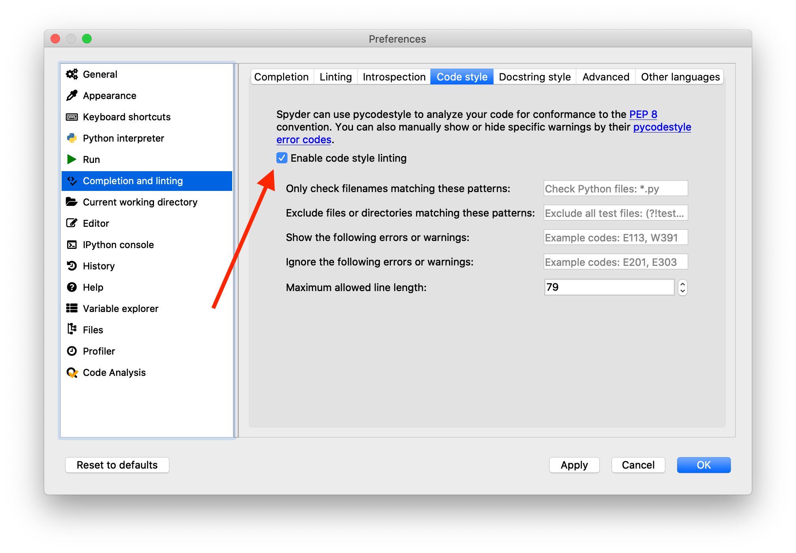

2 - Python Environment
======================
Components
----------
Python consists of the Python programming language, a Python interpreter (a program that interprets and runs Python code), and an extensive standard library. The reference (official) Python interpreter is written in the C programming language and is therefore called [CPython](https://github.com/python/cpython).


The Python programming language includes only relatively few keywords and built-in functions. However, the [standard library](https://docs.python.org/3/library/) extends the core functionality with additional data types, input/output, regular expressions, mathematical functions, data compression, network data handling, multimedia services, graphical user interfaces, and much more.

Furthermore, Python can be extended with third-party packages that are not part of the official Python distribution. Installing these packages is straightforward, because they are available from a central repository called the [Python Packaging Index (PyPI)](https://pypi.org). We will discuss how to install, update, and uninstall third-party packages later in this chapter.

As for any programming language, a good text editor or integrated development environment (IDE) is an essential tool for writing Python scripts. Good text editors include support for syntax highlighting, indentation, line numbers, [linting](https://en.wikipedia.org/wiki/Lint_(software)), code inspection, and more. Here is a selection of popular text editors (all of them are free, open source, and available on Windows, macOS, and Linux):

- [Visual Studio Code](https://code.visualstudio.com)
- [Atom](https://atom.io)
- [Spyder](https://www.spyder-ide.org)
- [PyCharm](https://www.jetbrains.com/pycharm/)

We will use Spyder in this workshop, mainly because it comes pre-installed with Anaconda. Spyder includes many useful features such as an integrated console running the Python interpreter, a comprehensive help system, and more. However, feel free to try out alternative editors and choose the one that best suits your needs.


Getting help
------------
One of the most important activities when programming is reading documentation. Besides running a search query in your favorite web search engine, the Python interpreter can display short help texts for many Python commands. For example, to view the documentation for the `print` function, you can type `help(print)` in the Python interpreter. Spyder includes an enhanced Python interpreter called [IPython](https://ipython.org), which supports the much shorter syntax `?print` or `print?`. Alternatively, you can press Ctrl&nbsp;+&nbsp;I (&#8984;&nbsp;+&nbsp;I on macOS) to display the help text in the integrated Spyder help window.


Managing Anaconda
-----------------
Even though Anaconda comes with many useful packages out of the box, it is still necessary to install additional packages once in a while. You might also want to uninstall packages that you don't need anymore to save disk space. Finally, it is generally a good idea to keep all Anaconda packages up to date, because package maintainers fix bugs and add new features over time.

All these tasks can be performed with the `conda` command line tool, which is part of every Anaconda distribution. We will explore how `conda` performs important package management tasks, but to get started we need to open a terminal:

- On Windows, open the "Anaconda Prompt" shortcut from the start menu.
- On macOS, open the "Terminal" app.
- On Linux, open the standard terminal program.

A terminal is a program that runs a shell which interprets text commands to control the operating system. This is similar to the Python interpreter, but note that both the terminal and specifically `conda` are *not* Python &ndash; these tools are necessary to manage an Anaconda Python distribution. Note that the `$` sign is the prompt for the terminal, so it is not part of the commands and should not be typed in (just like the Python prompt `>>>`).

Let's test if we can successfully run the `conda` tool. In the terminal, type:

```shell
$ conda --version
conda 4.8.2
```

This command should display the `conda` version (4.8.2 in the example). If it results in an error message, something is wrong with the Anaconda installation (in this case, consult the [installation instructions](https://docs.anaconda.com/anaconda/install/) to fix the problem).

It is useful to know which packages are installed on our computer. We can use the following command to find out:

```shell
$ conda list
```

This will generate a list of all installed packages, including their names and versions. If you want to know if a specific package is installed, you can append the package name to the command (replace `<package_name>` with the real name of the package):

```shell
$ conda list <package_name>
```

If the package is installed, the output will include a row with this package. If it is not installed, the output will be empty.

Before installing a new package, we need to know if it is available in Anaconda (note that we need to know the package *name*, otherwise we can't query and install a package). Use the following command to find out if a package named `<package_name>` is available:

```shell
$ conda search <package_name>
```

If the search returns results, you can install that package with:

```shell
$ conda install <package_name>
```

We will see what to do in case `conda` does not find the package in a moment.

It is straightforward to uninstall a package:

```shell
$ conda uninstall <package_name>
```

Finally, one of the most important commands keeps the Anaconda distribution up to date:

```shell
$ conda update --all
```

It is good practice to run this command on a regular basis (for example, once a month).

Anaconda has hundreds of packages in its [package repository](https://docs.anaconda.com/anaconda/packages/pkg-docs/), but there are thousands of Python packages that are not available in Anaconda. Since these packages cannot be installed using `conda`,  we need another way to make them available for use. This also applies if you use Python not installed via Anaconda.

The [Python Package Index (PyPI)](https://pypi.org/) is the canonical repository for third-party Python packages. Currently, it hosts over 200,000 packages. We can use the command line tool `pip` to install, uninstall, and update these packages. In essence, `pip` is very similar to `conda`. For example, to list all installed packages, type the following command:

```shell
$ pip list
```

Searching if a package called `<package_name>` is available is also possible:

```shell
$ pip search <package_name>
```

If available, a package can then be installed using:

```shell
$ pip install <package_name>
```

Finally, uninstalling works as expected:

```shell
$ pip uninstall <package_name>
```

In summary, if you have Anaconda the `conda` tool should be used to install packages whenever possible. Only if a package is not available in Anaconda, `pip` can be used instead.

Interactive vs. script mode
---------------------------
The Python interpreter can operate in two modes, namely in interactive or in script mode.

### Interactive mode
Interactive mode is useful for running single lines of code. Python immediately executes the command and shows its output. We have already used this mode before when we performed arithmetic calculations in the interactive interpreter window of Spyder. To recap, interactive mode features a prompt (either `>>>` or `In [1]:`), which means that Python is ready and waiting for user input. Importantly, Python also displays the results of calculations automatically in interactive mode. For example:

```python
>>> 1 + 4
5
```

The result `5` is displayed automatically right after the command. In general, if you start Python by typing `python` or `ipython` on the command line, Python will start in interactive mode. Python editors and IDEs (such as Spyder) typically open an interactive Python interpreter session by default. In addition, you can also select one or more lines of code in the editor pane and click the "Run selection" icon in Spyder. This runs the selected code in the interactive interpreter window.

### Script mode
In contrast to interactive mode, Python can run many lines of code in one go using script mode. A Python script is a plain text file (ending in `.py`) containing Python code. In general, one line contains exactly one code statement. Compared to interactive mode, Python does *not* display results automatically. For example, let's assume that the Python script named `test.py` contains the following line:

```python
1 + 4
```

When we run this script with `python test.py` from the command line, Python executes all commands line by line, but it does not automatically show the results. Therefore, there will be no output when running this script. In Spyder, you can run whole scripts by clicking the "Run script" icon. Alternatively, you can also run a whole script from IPython:

```python
>>> %run test.py
```

Python syntax
-------------
Let's return to the Python programming language and in particular its syntax (which describes the structure of code statements). One of the most unique features of Python is that it uses significant whitespace (in almost all cases this means spaces) for grouping code into blocks. This results in fewer lines of code, because no special grouping symbols (such as `begin`/`end` or `{`/`}`) are needed.

Consider the following example code:

```python
# this is a comment
def do_something(n_times=10):
    counter = 0
    for i in range(n_times):
        print(i)
        if i % 2:  # odd number
            counter += 1
            print("Odd")
    return counter

counter = do_something()
print(counter)
```

It is not important to understand what this snippet of code is doing (we will learn that in the following lessons), so let's focus on its structure.

First, we notice lines starting with a `#` character. These lines are comments, and Python ignores everything from the `#` character until the end of the line. This means that we can use comments to explain portions of the code in plain English (comments are important for programmers to help them understand a program). If we forget to prepend a comment with the `#` character, Python tries to interpret this as a command and in most cases this will result in a syntax error:

```python
>>> this is a comment
  File "<ipython-input-1-453a0c0169b5>", line 1
    this is a comment
              ^
SyntaxError: invalid syntax
```

With a proper comment, Python ignores everything and happily does nothing:

```python
>>> # this is a comment
```

In the code example, we also observe blocks of code indented to the right. By convention, most Pythonistas use four spaces to denote one level of indentation. Indented lines of code belong together. For example, the seven lines below `def do_something(n_times=10):` comprise a block of code belonging to that statement (note that statements introducing a block always end with a `:`). Within this block, there are two additional blocks defined by additional indentation.

Blocks are necessary to define scopes, something which we will discuss later in this course.

Finally, the example shows the syntax of function calls. We will discuss functions later in this course, for now you can think of a function as a mini-program (or mini-script). Whenever you call a function, Python runs the whole mini-program defined in the function. The syntax for calling a function is a pair of parenthesis `()` right after the name of the function. In the example code, `range(n_times)`, `print(i)`, `print("Odd")`, `do_something()`, and `print(counter)` are all function calls. Note that you can supply so-called arguments between the parentheses if the function takes parameters. All function calls in the example have exactly one argument, except for `do_something()`, which has no argument. Arguments allow us to pass additional information to the function.

Like most programming languages, Python is very picky about correct syntax. For example, capitalization matters so that `print` is not the same as `Print`. A missing `:` in places where a colon should be triggers a syntax error. Incorrect indentation can either lead to a syntax error or to non-intended behavior (which means the Python program runs without errors, but does not do what the programmer intended). It is very instructive to just try out code in the interactive interpreter, for example:

```python
>>> Print("Hello")
---------------------------------------------------------------------------
NameError                                 Traceback (most recent call last)
<ipython-input-2-b39576d35bb3> in <module>
----> 1 Print("Hello")

NameError: name 'Print' is not defined
```

It is important to be familiar with Python error messages in order to interpret them efficiently (after all, the goal should be to fix the error), so make errors and learn from them!

On the other hand, there are also stylistic issues that Python doesn't care about at all. The following two statements are equivalent for Python:

```python
>>> x = 1 + 2 + 3 * (16 - 7)
>>> x=1+    2+  3*  (   16-7    )
```

Arguably, the first one is much easier to read though. The [Python Enhancement Proposal 8 (PEP8)](https://www.python.org/dev/peps/pep-0008/) summarizes coding conventions that describe how Python code should look like in order to enhance readability. It is worth going through the document (at least superficially), but good editors perform PEP8 checks automatically as you type code in your editor. In Spyder, this option is disabled by default, but you can enable it in Preferences &ndash; Completion and linting &ndash; Code style &ndash; Enable code style linting.



Additional learning resources
-----------------------------
Here are a few Python resources for beginners that might be helpful in addition to this course.

### Online documentation
- The [official Python documentation](https://docs.python.org/3/) has everything you need to know, including a nice [tutorial](https://docs.python.org/3/tutorial/index.html).
- If you search the web for a specific Python problem, chances are that you will land on [Stack Overflow](https://stackoverflow.com/questions/tagged/python), which has many questions and answers related to Python.

### Online courses
- [Learn to Program: The Fundamentals](https://www.coursera.org/learn/learn-to-program)
- [Learn to Program: Crafting Quality Code](https://www.coursera.org/learn/program-code)
- [Programming for Everybody (Getting Started with Python)](https://www.coursera.org/learn/python)
- [Python Data Structures](https://www.coursera.org/learn/python-data)
- [An Introduction to Interactive Programming in Python (Part 1)](https://www.coursera.org/learn/interactive-python-1)
- [An Introduction to Interactive Programming in Python (Part 2)](https://www.coursera.org/learn/interactive-python-2)
- [Learn Python](http://www.learnpython.org/)
- [Real Python](https://realpython.com/)

### Books
- [Think Python](http://greenteapress.com/wp/think-python/)
- [A Byte of Python](http://python.swaroopch.com/)
- [Python for You and Me](http://pymbook.readthedocs.io/en/latest/)
- [Python Crash Course](https://nostarch.com/pythoncrashcourse2e)

Exercises
---------
1. Create a list of all installed packages in your Anaconda distribution.
2. Update all installed Anaconda packages. Find out if `seaborn` and `plotly` are installed, and if not, install the packages.
3. Install the `mne` package.
4. Create a short Python script called `test.py` with the following contents:
   - The first line should be a comment with your name.
   - The second line should be empty.
   - The third line should use the `print` function to print something on the screen.
   - The last line should be empty.

   Make sure that the script does not contain any PEP8 warnings.
5. Display the help text for the `print` function in the Python interpreter (list all three options possible in IPython).

---
 This document is licensed under the [CC BY-NC-SA 4.0](https://creativecommons.org/licenses/by-nc-sa/4.0/) by Clemens Brunner.