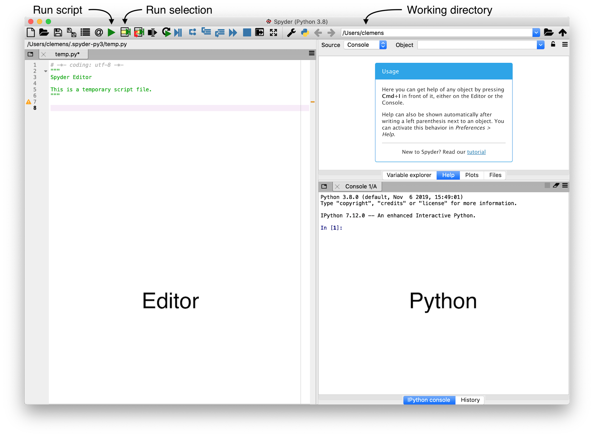

2 - Python Environment
======================
Components
----------
Python consists of the Python programming language, a Python interpreter (which is a program that can interpret and run Python code), and an extensive standard library. The reference (official) Python interpreter is written in the C programming language and is therefore called [CPython](https://github.com/python/cpython).


The Python programming language includes only relatively few keywords and built-in functions. However, the [standard library](https://docs.python.org/3/library/) extends the core functionality with additional data types, input/output, regular expressions, mathematical functions, data compression, network data handling, multimedia services, graphical user interfaces, and much more.

Furthermore, Python can be extended with third-party packages that are not part of the official Python distribution. Installing these packages is straightforward, because they are available from a central repository called the [Python Packaging Index (PyPI)](https://pypi.org). We will discuss how to install, update, and uninstall third-party packages later in this chapter.

As for any programming language, a good text editor or integrated development environment (IDE) is an essential tool for writing Python scripts. Good text editors include support for syntax highlighting, indentation, line numbers, code inspection, and more. Here is a selection of popular text editors (all of them are free, open source, and available on Windows, macOS, and Linux):

- [Visual Studio Code](https://code.visualstudio.com)
- [Atom](https://atom.io)
- [Spyder](https://www.spyder-ide.org)
- [PyCharm](https://www.jetbrains.com/pycharm/)

We will use Spyder in this workshop, mainly because it comes pre-installed with Anaconda. Spyder includes many useful features such as an integrated console running the Python interpreter, a comprehensive help system, and more. However, feel free to try out alternative editors and choose the one that best suits your needs.



Getting help
------------
One of the most important activities when programming is reading documentation. Besides running a search query in your favorite web search engine, the Python interpreter can display short help texts for many Python commands. For example, to view the documentation for the `print` function, you can type `help(print)` in the Python interpreter. Spyder includes an enhanced Python interpreter called [IPython](https://ipython.org), which supports the much shorter syntax `?print` or `print?`. Alternatively, you can press Ctrl&nbsp;+&nbsp;I (&#8984;&nbsp;+&nbsp;I on macOS) to display the help text in the integrated Spyder help window.


Managing Anaconda
-----------------
Even though Anaconda comes with many useful packages out of the box, it is still necessary to install additional packages once in a while. You also might want to uninstall packages that you don't need anymore to save some space. Finally, it is generally a good idea to keep all Anaconda packages up to date, because package maintainers fix bugs and add new features over time.

All these tasks can be performed with the `conda` command line tool, which is part of every Anaconda distribution. We will explore how `conda` performs important package management tasks, but to get started we need to open a terminal first:

- On Windows, open the "Anaconda Prompt" shortcut from the start menu.
- On macOS, open the "Terminal" app.
- On Linux, open the standard terminal program.

A terminal is a program that runs a shell which interprets text commands to control the system. This is similar to the Python interpreter, but note that both the terminal and specifically `conda` are *not* Python &ndash; these tools are necessary to manage an Anaconda Python distribution. Note that the `$` sign is the prompt for the terminal, so it is not part of the commands and should not be typed in.

Let's test if we can successfully run the `conda` tool. In the terminal, type:

```shell
$ conda --version
conda 4.8.2
```

This command should display the `conda` version (4.8.2 in the example). If it results in an error message, something is wrong with the Anaconda installation (in this case, consult the [installation instructions](https://docs.anaconda.com/anaconda/install/) to fix the problem).

It is useful to know which packages are installed in our Anaconda distribution. We can use the following command to find out:

```shell
$ conda list
```

This will generate a list of all installed packages, including their names and versions. If you want to know if a specific package is installed, you can append the package name to the command (replace `<package_name>` with the real name of the package):

```shell
$ conda list <package_name>
```

If the package is installed, the output will include a row with this package. If it is not installed, the output will be empty.

Before installing a new package, we need to know if it is available in Anaconda (note that we need to know the package *name*, otherwise we can't query and install a package). Use the following command to find out if a package named `<package_name>` is available:

```shell
$ conda search <package_name>
```

If the search returns results, you can install that package with:

```shell
$ conda install <package_name>
```

We will see what to do in case `conda` does not find the package in a moment.

It is straightforward to uninstall a package:

```shell
$ conda uninstall <package_name>
```

Finally, one of the most important commands keeps the Anaconda distribution up to date:

```shell
$ conda update --all
```

It is good practice to run this command on a regular basis (for example, once a month).

Anaconda has hundreds of packages in its [package repository](https://docs.anaconda.com/anaconda/packages/pkg-docs/), but there are thousands of Python packages that are not available in Anaconda. Since these packages cannot be installed using `conda`,  we need another way to make them available for use.

The [Python Package Index (PyPI)](https://pypi.org/) is the canonical repository for third-party Python packages. Currently, it hosts over 200,000 packages. We can use the command line tool `pip` to install, uninstall, and update these packages. In essence, `pip` works very similar to `conda`. For example, to list all installed packages, type the following command:

```shell
$ pip list
```

Searching if a package called `<package_name>` is available is also possible:

```shell
$ pip search <package_name>
```

A package can then be installed using:

```shell
$ pip install <package_name>
```

Finally, uninstalling works as expected:

```shell
$ pip uninstall <package_name>
```

Note that it is actually better to use `python -m pip` instead of `pip` (see this [blogpost](https://snarky.ca/why-you-should-use-python-m-pip/) by Python core developer Brett Cannon for an in-depth explanation).

In summary, the `conda` tool should be used to install packages whenever possible. Only if a package is not available in Anaconda, `pip` can be used instead.

Interactive vs. script mode
---------------------------
The Python interpreter can operate in two modes, either in interactive or in script mode.

### Interactive mode
The interactive mode is useful for running single lines of code. Python immediately executes the command and shows its output. We have already used this mode before when we performed arithmetic calculations in the interactive interpreter window of Spyder. To recap, the interactive mode features a prompt (either `>>>` or `In [1]:`), which means that Python is ready and waiting for user input. Importantly, Python also displays the results of calculations automatically in interactive mode. For example:

```python
>>> 1 + 4
5
```

The result `5` is displayed automatically right after the command. In general, if you start Python by typing `python` or `ipython` on the command line, Python will start in interactive mode. Python editors and IDEs (such as Spyder) typically open an interactive Python interpreter session by default. In addition, you can also select one or more lines of code in the editor pane and click the "Run selection" icon in Spyder. This runs the selected code in the interactive interpreter.

### Script mode
In contrast to the interactive mode, Python can run many lines of code in one go using the script mode. A Python script is a plain text file (ending in `.py`) containing Python code. In general, one line contains exactly one code statement. Compared to the interactive mode, Python does *not* display results automatically. For example, let's assume that the Python script named `test.py` contains the following line:

```python
1 + 4
```

When we run this script with `python test.py` from the command line, Python executes all commands line by line, but it does not automatically show the results. Therefore, there will be no output when running this script in script mode. In Spyder, you can run whole scripts by clicking the "Run script" icon.

Python syntax
-------------
Let's return to the Python programming language and in particular its syntax (which describes the structure of code statements).

---
 This document is licensed under the [CC BY-NC-SA 4.0](https://creativecommons.org/licenses/by-nc-sa/4.0/) by Clemens Brunner.