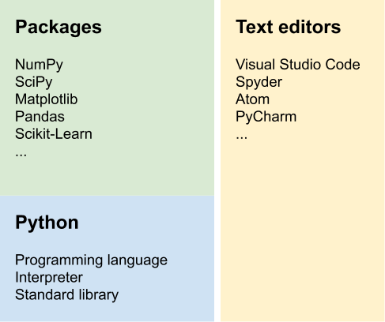

2 – Python environment
======================
Components
----------
Python consists of the Python programming language, a Python interpreter (a program that interprets and runs Python code), and an extensive standard library. The reference (official) Python interpreter is written in the C programming language and is therefore called [CPython](https://github.com/python/cpython).



The Python programming language includes only relatively few keywords and built-in functions. However, the [standard library](https://docs.python.org/3/library/) extends the core functionality with additional data types, input/output, regular expressions, mathematical functions, data compression, networking, multimedia services, graphical user interfaces, and much more.

Python can also be extended with third-party packages that are not part of the official Python distribution. Installing these packages is straightforward, because they are available from a central repository called the [Python Packaging Index (PyPI)](https://pypi.org). We will discuss how to install, update, and uninstall third-party packages later in this chapter.

As for any programming language, a good text editor or integrated development environment (IDE) is an essential tool for writing Python scripts. Good text editors include support for syntax highlighting, indentation, line numbers, [linting](https://en.wikipedia.org/wiki/Lint_(software)), code inspection, and more. Here is a selection of popular text editors (all of them are free, open source, and available on Windows, macOS, and Linux):

- [Visual Studio Code](https://code.visualstudio.com)
- [PyCharm](https://www.jetbrains.com/pycharm/)
- [Atom](https://atom.io)
- [Spyder](https://www.spyder-ide.org)

We will use Visual Studio Code in this workshop, but feel free to try out alternative editors and choose the one that best suits your needs.

Visual Studio Code
------------------
After installing [Visual Studio Code](https://code.visualstudio.com/), there are a few things you need to tweak for a great Python editing experience.

First, go to the *Extensions* section in the left sidebar, search for "Python", and install the official Python extension.

Second, I recommend that you enable PEP8 style checking. Open the Command Palette (Ctrl&nbsp;+&nbsp;Shift&nbsp;+&nbsp;P on Windows and Linux, ⌘&nbsp;+&nbsp;Shift&nbsp;+&nbsp;P on macOS) and type "linter". Click on the entry "Python: Select Linter" and choose "flake8". If Visual Studio Code asks if you want to install the flake8 tool, click on "Install" (alternatively, you can always `pip install flake8` at any time). If everything worked, Visual Studio Code will now highlight code that does not comply with PEP8, and you should try to fix all of these warnings.

Getting help
------------
One of the most important activities when programming is reading documentation. Besides running a search query in your favorite web search engine, the Python interpreter can display short help texts for many Python commands. For example, to view the documentation for the `print` function, you can type `help(print)` in the Python interpreter. The popular enhanced interactive Python interpreter called [IPython](https://ipython.org) supports the much shorter syntax `?print` or `print?`. We will learn how to install it in the next section.

Managing packages
-----------------
Almost any real-world project requires functionality that is not available in Python out of the box. Therefore, it is important to know how to install additional packages (from PyPI). You might also want to uninstall packages that you don't need anymore to save disk space. It is also a good idea to keep all installed packages up to date, because package maintainers fix bugs and add new features in new releases.

All these tasks can be performed with the `pip` command line tool, which is contained in the `pip` package that is bundled with Python. We will explore how `pip` performs important package management tasks. First, we need to open a terminal:

- On Windows, open the "Command Prompt" or "Windows Terminal" app from the start menu.
- On macOS, open the "Terminal" app.
- On Linux, open your favorite terminal app.

A [terminal](https://en.wikipedia.org/wiki/Terminal_emulator) is a program that runs a [shell](https://en.wikipedia.org/wiki/Shell_(computing)) which interprets text commands to control the operating system. Note that the `$` sign is the prompt for the terminal, so it is not part of the commands and should not be typed in (just like the Python prompt `>>>`). On Windows, the default prompt is the path followed by a `>` character (such as `C:\Program Files\>`), but we will use `$` throughout the course material.

Let's test if we can successfully run the `pip` tool. In the terminal, type:

```shell
$ pip --version
pip 21.3.1 from /usr/local/lib/python3.10/site-packages/pip (python 3.10)
```

This command should display the `pip` version (21.3.1 in the example) and its location in the file system. If this results in an error message, something is wrong with your Python installation (in this case, consult the [installation instructions](https://docs.python.org/3/using/index.html) to fix the problem).

It is useful to know which Python packages are already installed. We can use the following command to find out:

```shell
$ pip list
```

This will generate a list of installed packages, including their names and versions. If you want to see more details about an installed package, use the following command (the example uses the `setuptools` package, so replace the package name with the desired package you would like to inspect):

```shell
$ pip show setuptools
```

If the package is not installed, you will get a warning message.

Before installing a new package, we need to know the name of the package. You can query the [PyPI website](https://pypi.org/) to find out if a specific package exists.

If the search returns results, you can install that package (replace `<package_name>` with the actual name):

```shell
$ pip install <package_name>
```

We mentioned the `ipython` package previously, an enhanced interactive Python interpreter. If you want to give it a try, go ahead and install it with `pip install ipython`!

It is pretty straightforward to uninstall a package:

```shell
$ pip uninstall <package_name>
```

Finally, you can get a list of outdated packages with:

```shell
$ pip list --outdated
```

If this command shows packages that have newer versions available, you can upgrade each individual package with:

```shell
$ pip install --upgrade <package_name>
```

Interactive vs. script mode
---------------------------
The Python interpreter can operate in two modes, namely in interactive or in script mode.

### Interactive mode (REPL)
Interactive mode is useful for running single lines of code, because Python immediately shows the result. We have already used this mode before when we used Python as a calculator. To recap, interactive mode features a prompt (either `>>>` or `In [1]:`), which indicates that Python is ready and waiting for user input. Importantly, Python also displays the results of calculations automatically in interactive mode. For example:

```python
>>> 1 + 4
5
```

The result `5` is displayed automatically right after the command. In general, if you start Python by typing `python` (or `ipython` if you have installed the `ipython` package) on the command line, Python will start in interactive mode. In case you were wondering, you can exit the interactive interpreter by typing `exit()` (or Ctrl+D on macOS or Linux).

### Script mode
In contrast to interactive mode, Python can run many lines of code in one go using script mode. A Python script is a plain text file (ending in `.py`) containing Python code. In general, one line contains exactly one code statement. Compared to interactive mode, Python does *not* display results automatically. For example, let's assume that a Python script named `test.py` contains the following line:

```python
1 + 4
```

When we run this script with `python test.py` from the command line, Python executes all commands line by line, but it does not automatically show the results. Therefore, there will be no output when running this script. However, you can always explicitly print something on the screen with the `print` function (more on functions later), so in this example we could write `print(1 + 4)` instead.

Python syntax
-------------
Let's return to the Python programming language and in particular its syntax (which describes the rules and structure of code statements). One of the most unique features of Python is that it uses significant [whitespace](https://en.wikipedia.org/wiki/Whitespace_character) (in almost all cases this means spaces) for grouping code into blocks. This results in fewer lines of code, because no special grouping symbols (such as `begin`/`end` or `{`/`}`) are needed.

Consider the following example code snippet:

```python
# this is a comment
def do_something(n_times=10):
    counter = 0
    for i in range(n_times):
        print(i)
        if i % 2:  # odd number
            counter += 1
            print("Odd")
    return counter

counter = do_something()
print(counter)
```

It is not important to understand what this code is doing (we will learn that in the following lessons), so let's focus on its structure.

First, we notice a line starting with a `#` character. This line is a *comment*, and Python ignores everything from the `#` character until the end of the line. This means that we can use comments to explain portions of the code in plain English. If we forget to prepend a comment with the `#` character, Python tries to interpret this as a command, and in most cases this will result in a syntax error:

```python
>>> this is a comment
  File "<stdin>", line 1
    this is a comment
              ^^^^^^^
SyntaxError: invalid syntax
```

Using a proper comment, Python ignores everything and happily does nothing:

```python
>>> # this is a comment
```

In the code example, we also observe blocks of code *indented* to the right. By convention, most Pythonistas use four spaces to denote one level of indentation. Indented lines of code belong together. For example, the seven lines below `def do_something(n_times=10):` define a block of code belonging to that statement (note that statements introducing a block always end with a `:`). Within this block, there are two additional blocks defined by additional indentation.

Blocks are necessary to define scopes, something which we will discuss later in this course.

Finally, the example contains *function calls*. We will discuss functions later in this course, for now you can think of a function as a mini-program (or mini-script). Whenever you call a function, Python runs the whole mini-program defined by the function. The syntax for calling a function is a pair of parenthesis `()` right after the name of the function. In the example code, `range(n_times)`, `print(i)`, `print("Odd")`, `do_something()`, and `print(counter)` are all function calls. Note that you can supply so-called *arguments* between the parentheses if the function takes parameters. All function calls in the example have exactly one argument, except for `do_something()`, which has no argument. Arguments allow us to pass additional information to the function.

Like most programming languages, Python is very picky about correct syntax. For example, capitalization matters, so `print` is not the same as `Print`. A missing `:` in places where a colon should be triggers a syntax error. Incorrect indentation can either lead to a syntax error or to non-intended behavior (which means the Python program runs without errors, but does not do what the programmer intended). It is very instructive to just try out code in the interactive interpreter, for example:

```python
>>> Print("Hello")
Traceback (most recent call last):
  File "<stdin>", line 1, in <module>
NameError: name 'Print' is not defined. Did you mean: 'print'?
```

It is important to be familiar with Python error messages to interpret them efficiently (after all, the goal should be to fix the error), so make errors and learn from them!

Python code style
-----------------
On the other hand, there are also stylistic issues that Python doesn't care about at all. The following two statements are equivalent for Python:

```python
>>> x = 1 + 2 + 3 * (16 - 7)
>>> x=1+    2+  3*  (   16-7    )
```

Arguably, the first one is much easier to read. The [Python Enhancement Proposal 8 (PEP8)](https://www.python.org/dev/peps/pep-0008/) summarizes coding conventions that describe how Python code should look like to enhance readability. It is worth going through the document (at least superficially), but most editors perform PEP8 checks automatically as you type. The next section shows how to enable this so-called [linting](https://en.wikipedia.org/wiki/Lint_(software)) in Visual Studio Code.

Additional learning resources
-----------------------------
Here are a few Python resources for beginners that might be helpful in addition to this course.

### Online documentation
- The [official Python documentation](https://docs.python.org/3/) has everything you need to know, including a nice [tutorial](https://docs.python.org/3/tutorial/index.html).
- If you search the web for a specific Python problem, chances are that you will land on [Stack Overflow](https://stackoverflow.com/questions/tagged/python), which has many questions and answers related to Python.

### Online courses
- [Learn to Program: The Fundamentals](https://www.coursera.org/learn/learn-to-program)
- [Learn to Program: Crafting Quality Code](https://www.coursera.org/learn/program-code)
- [Programming for Everybody (Getting Started with Python)](https://www.coursera.org/learn/python)
- [Python Data Structures](https://www.coursera.org/learn/python-data)
- [An Introduction to Interactive Programming in Python (Part 1)](https://www.coursera.org/learn/interactive-python-1)
- [An Introduction to Interactive Programming in Python (Part 2)](https://www.coursera.org/learn/interactive-python-2)
- [Real Python](https://realpython.com/)

### Books
- [Python Basics](https://realpython.com/products/python-basics-book/)
- [Think Python](https://greenteapress.com/wp/think-python-2e/)
- [A Byte of Python](http://python.swaroopch.com/)
- [Python for You and Me](http://pymbook.readthedocs.io/en/latest/)
- [Python Crash Course](https://nostarch.com/pythoncrashcourse2e)

Exercises
---------
1. Create a list of installed packages in your Python environment.
2. Update all installed packages. Find out if `ipython` and `numpy` are installed, and if not, install these packages.
3. Install the `mne` package. Afterwards, uninstall it again.
4. Create a short Python script called `test.py` with the following contents:
   - The first line should be a comment with your name.
   - The second line should be empty.
   - The third line should use the `print` function to print something on the screen.
   - The last line should be empty.

   Make sure that the script does not contain any PEP8 warnings!
5. Display the help text for the `print` function in the interactive Python interpreter.

---
 This document is licensed under the [CC BY-NC-SA 4.0](https://creativecommons.org/licenses/by-nc-sa/4.0/) by Clemens Brunner.