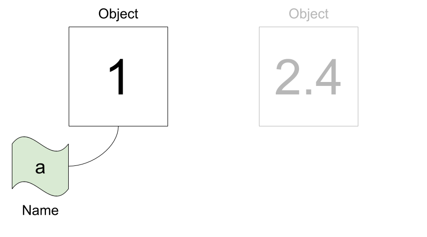
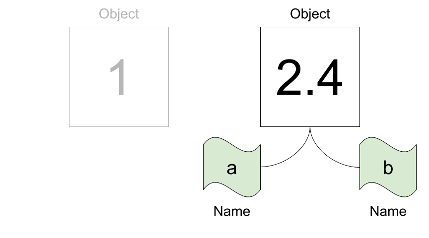

3 – Names, expressions, and statements
======================================
Objects, values, and types
--------------------------
Everything in Python is an *object*. An object is an entity which has a value, a type, and a unique ID. For example, the number `1` we used in our arithmetic calculations is an object. It has the value `1` and the type `int` (which means integer number). Here are a few additional examples of objects:

```python
>>> 1
1
```

```python
>>> 2.15
2.15
```

```python
>>> "Hello world!"
'Hello world!'
```

```python
>>> '3'
'3'
```

As we already know, Python outputs the *value* of the last command automatically in the REPL. That's why we know the value of the `1` object is `1`, and the value of the `"Hello world!"` object is `'Hello world!'`.

To find out the type of a given object, we can use the built-in `type` function as follows:

```python
>>> type(1)
int
```

```python
>>> type(2.15)
float
```

```python
>>> type("Hello world!")
str
```

```python
>>> type('3')
str
```

Apparently, whole numbers are of type `int` (integer number), decimal numbers are `float` (floating point number), and character strings enclosed by single or double quotes are `str` (string) objects.

Conceptually, we can think of an object as an entity of a specific type with a specific value:


Names
-----
Objects can have names (in other programming languages names are often called variables). We can assign a name to an object with the assignment operator `=` as follows:

```python
>>> a = 1
```

This attaches the name `a` to the object `1` (of type `int`). We can visualize names as tags or labels attached to an object.



Python lets us reassign an existing name to a different object. Notice how the object on the left does not have a name anymore.

```python
>>> a = 2.4
```


An object can also have more than one name attached to it:

```python
>>> b = a
```



The type of a name corresponds to the type of the object the name is attached to:

```python
>>> type(a)
float
>>> type(b)
float
```

Whenever Python works with a name, it always replaces it with the value of the corresponding object. Furthermore, Python always evaluates the right-hand side of an assignment first before assigning the name. Consider the following example:

```python
>>> x = 11
>>> 9 + x  # x is evaluated to 11, then 9 + 11 is evaluated to 20
20
>>> x = 2
>>> 2 * x  # x is evaluated to 2, then 2 * 2 is evaluated to 4
4
>>> x = 2 * x  # first evaluate the right-hand side to 2 * 2 = 4, then assign x = 4
```

Choosing names
--------------
### Basic rules
Valid names can contain letters (lower and upper case), digits, and underscores (but a name must not start with a digit). [PEP8](https://www.python.org/dev/peps/pep-0008/#naming-conventions) lists recommendations for choosing names &ndash; we only need to remember one rule for now: most names should be lowercase with underscores, for example `lower_case_with_underscores`. Furthermore, names should convey meaning, so instead of a generic `x` we should try to find a name that tells us something about its intended use. Also, it is good practice to use English (and not e.g. German) names, because you never know who will read your code in the future.

Here are a few valid examples for naming an object which contains the number of students in a particular class:

```python
>>> number_of_students_in_class = 23  # too long
>>> NumberOfStudents = 23  # wrong style, separate with underscores
>>> n_students = 23  # pretty nice
>>> n = 23  # too short (but this may be OK sometimes)
```

### Keywords
Python defines several keywords that are core components of the language. They *cannot* be used to name objects, so it is important to know what these keywords are. The following code snippet produces a list of all keywords:

```python
>>> import keyword
>>> keyword.kwlist
['False',
 'None',
 'True',
 'and',
 'as',
 'assert',
 'async',
 'await',
 'break',
 'class',
 'continue',
 'def',
 'del',
 'elif',
 'else',
 'except',
 'finally',
 'for',
 'from',
 'global',
 'if',
 'import',
 'in',
 'is',
 'lambda',
 'nonlocal',
 'not',
 'or',
 'pass',
 'raise',
 'return',
 'try',
 'while',
 'with',
 'yield']
 ```

For example, this means that you cannot use the name `break`. If you do, Python will generate an error:

```python
>>> break = 7
  File "<stdin>", line 1
    break = 7
          ^
SyntaxError: invalid syntax
```

### Built-in functions
Python also has a number of [built-in functions](https://docs.python.org/3/library/functions.html) that are always available (without importing). Although it is possible to assign the names of these built-in functions to other objects, it is considered bad practice because it might lead to subtle bugs. The following code generates a list of all built-ins:

```python
>>> dir(__builtins__)
['ArithmeticError',
 'AssertionError',
 'AttributeError',
 'BaseException',
 'BlockingIOError',
 'BrokenPipeError',
 ...
 'sum',
 'super',
 'tuple',
 'type',
 'vars',
 'zip']
```

Operators
---------
In general, operators work with objects. We have already used several (arithmetic) operators such as `+`, `-`, `*`, `/`, `**`, `//`, and `%`. Some operators are *binary* and require *two* operands (for example, the multiplication `2 * 3`), whereas other operators are *unary* and require only *one* operand (for example, the negation `-5`).

Expressions
-----------
An *expression* is any combination of values, names, and operators. Importantly, an expression *always evaluates to a value* (or short, an expression *has* a value). Here are a few examples for expressions (remember that their values are automatically printed in the REPL):

```python
>>> 17  # just one value
17
>>> 23 + 4**2 - 2  # four values and three operators
37
>>> n = 25  # an assignment is not an expression!
>>> n  # one name (evaluates to its value)
25
>>> n + 5  # a name, an operator, and a value
30
```

Python reduces an expression to a *single value*. A more complex expression is evaluated step by step according to operator precedence rules (think [PEMDAS](https://en.wikipedia.org/wiki/Order_of_operations#Mnemonics)) from left to right.

Statements
----------
A statement is a unit of code which Python can execute. This is a rather broad definition, and statements therefore include expressions as a special case (an expression is a statement with a value). However, there are also statements that do not have a value such as an assignment. Here are two examples for statements that are not expressions:

```python
>>> x = 13
>>> print("Hello world!")
Hello world!
```

Note that although the `print` statement generates output, this output is not its value (try assigning a name to the function call)!

Exercises
---------

1. Determine if the following names are valid, and if they are, decide if they comply with PEP8 conventions. Describe whether each name is a good name for an object containing a string or an integer number.
   - `2x`
   - `_`
   - `x23`
   - `_name`
   - `alpha`
   - `lambda`
   - `Name`
   - `X2`
   - `sum`
   - `test-case`

2. Consider these three assignments:
   ```python
   width = 17
   height = 12
   delimiter = "."
   ```
   Determine both the value and type of the following expressions:
   - `width / 2`
   - `height / 3`
   - `height * 3`
   - `height * 3.0`
   - `delimiter * 5`
   - `2 * (width + height) + 1.5`
   - `12 + 3`
   - `"12 + 3"`

3. Calculate the area and volume of a sphere with radius $r = 5$. Use the names `r`, `area`, and `volume` to compute these quantities. The number $\pi$ is available as `math.pi` after running `import math`.

4. What is the type of the value `True`? What is the type of the value `'True'`? What is the type of the name `math` that you imported in the previous exercise?

---
 This document is licensed under the [CC BY-NC-SA 4.0](https://creativecommons.org/licenses/by-nc-sa/4.0/) by [Clemens Brunner](https://cbrnr.github.io/).